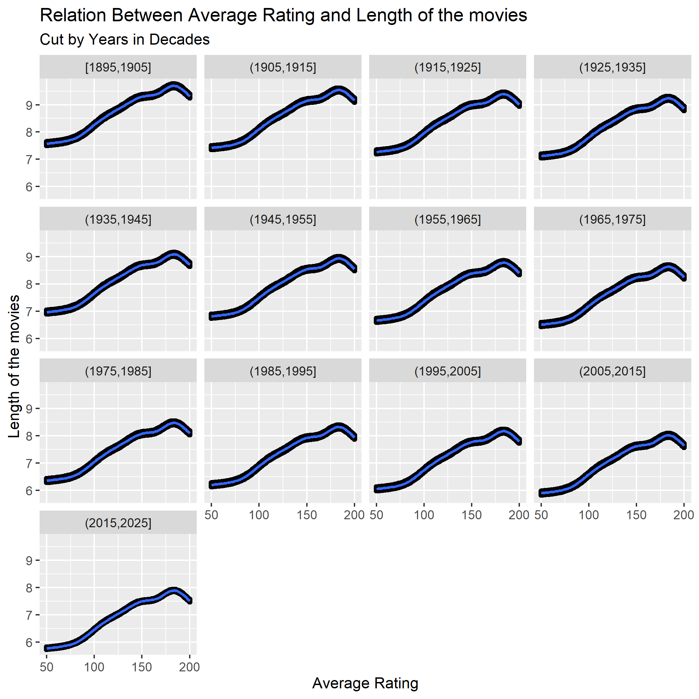

```{r setup, include=FALSE}
knitr::opts_chunk$set(echo = TRUE)
```

### 1.  Fit a model to predict a movie’s IMDB rating (variableaverageRating) by year (startYear)and length (runtimeMinutes.)  You will have to make a number of modeling choices:

#### (a)  Do you need any transformations?
####  I tried multiple transformations. I used logarithmic transformations, and square transformations, but there was not any difference in the results so, I did not perform any transformations on the data.

#### (b)  Should you fit a linear model or something curved?
####  I used both weighted and non-weightd lm and gam, but the residual plots for weighted gam was  gave better result than other models.I have used smoothing transformation on runtimeMinutes as it gave better results.


#### (c)  Is an additive model adequate?
####  The gam model showed better results than lm model. but, gam model is not adequate. It has R square value of 0.214 and deviance explained 22.8%.

#### (d) Do you need to filter out or downweight tail values to prevent the fit from being dominated by outliers?
#### SInce, the outliers do not contribute in the data, we Filter out the tail values for the runtimeMinutes. Usually, movies are in the range of 50 minutes to 200 minutes. So, I am dropping all movies with length lesser than 50 and greater than 200 minutes.

#### (e) Should you weight by number of votes?
#### After using both weighted and non-weightd lm and gam, I can say that the weighted gam model showed better result than non-weighted gam model. the non-weighted gam model had a R-square rating of 0.0268 and deviance explained was 2.68% whereas the weighed gam model had  R square value of 0.214 and deviance explained 22.8%.

### 2.  Draw ONE set of faceted plots to display the model — either condition on year or length,whichever seems to you to be more interesting.  Choose a sensible number of panels.  Briefly describe what this set of plots shows you.
#### Using 10 as the panel number, I am drawing faceted plots for the weighted gam model with the condtion in runtimeMinutes and faceting it on the year column. We can see that the average ratings of the movies increase as the runtime increases, but the pattern in the graph is similar for every decade, so from the faceted plots, we can say that though the raitngs of the movies increase with increase in runtime but it does not show any dependency on startYear.

```{r include=FALSE}


```

### 3.  Draw a raster-and-contour plot (or other “3D” plot of your choice) to further display yourmodel.  The plot should show predictions for the majority of movie years and lengths (youdon’t have to show outliers.)  Briefly describe what, if anything, this plot shows you that yourplot for question 2 didn’t.

#### From the contour plots, we cans see that ratings increase as runtime increases. For Example, when the runtime is near 50, the ratings are near 6 or 7 and as runtime reaches 100, we get some movies with ratings near 8 and as the runtime increases to 150-200 we get moves with ratings 9 and above. We can also see the there dependency on the year column. We can see that the as the year increases ,the ratings also change.The shorter movies , the older movies have slightly higher rating than the recent movies. Even for the longer movies, the older movies have higher rating than recent movies. For Example, the shorter movies of 50 mintues, the older movies have ratings of 7 whereas the recent movies have rating of 6. SImilarly, for longer movies of 150-200 minutes, the older movies have higher ratings of 9 and above but the recent movies have there ratings till 8. In the facet plots we couldn't see how does the year affects the ratings of the movies, but in the contour plots we can see the affect of year on the ratings

### 4.  Answer the substantive question:  Do longer movies tend to get higher IMDB ratings, after accounting for their year of release?  (The answer will likely be more complicated than “yes”or “no.”)
#### From the above contour plot we can say that, the longer movies tend to get higher IMDB ratings and it also shows some dependency on year of release. As seen in contour plots, the range for the ratings of movies tend to change as the year increases. This means, for older movies we get a much broader range, For example, for the year 1920, the shorter movies have there ratings starting from 6 whereas the longer movies, have there ratings staring from 9, so the range is starts from 6 and it crosses 9, but for recent movies, the range is much smaller, for example in the year 2000, the shorter movies has the rating of 6 but the longer movies have the rating of 8, so there range starts from 6 and reaches 8. So, the longer movies tend to get higher IMDB ratings, even after accounting their year of releasr but the range for the rating differs and it gets smaller as the year progresses.
